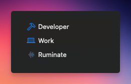

## Custom Finder Sidebar Icons

An Xcode project to set custom icons for folders in the Finder sidebar. `Developer` is a built-in icon, but `Work` and `Ruminate` are using the [SF Symbols](https://developer.apple.com/sf-symbols/) `laptopcomputer` and `waveform` respectively:



This is a small Xcode project based on a combination of [this Reddit post](https://www.reddit.com/r/mac/comments/seig87/how_to_make_custom_finder_sidebar_icons_big_sur/) and this documentation about [CFBundleSymbolName](https://developer.apple.com/documentation/fileprovider/replicated_file_provider_extension/setting_the_finder_sidebar_icon). For each custom icon and folder, you need to run a [Finder Sync app](https://developer.apple.com/documentation/findersync#) (like Dropbox does) which allows the app to set custom sidebar icons, among other things.

## Limitations

- Folders inside Dropbox and Google Drive won't work. To make them work, create an alias to the folder and set _that_ as the path in `URLs`
- Your app name needs to be unique, hence the `rename` script. Attempting to run two apps of the same name causes weird issues.
- To stop your icon app running, you need to delete the app or reboot.
- All of this is _very_ flaky. If it doesn't work, try cleaning the build folder in Xcode and rebuilding (Product > Clean Build Folder). As a last resort a reboot seemed to fix it on a few occasions.

## Setup

Clone or download this repository and then run the following with your options filled in:

- `APPNAME` is the name of your new app. This can be anything, I tend to do `FolderNameIcon`
- `PATH` is the folder you want to have a custom icon for
- `SFSYMBOL` is the SF Symbol you want to use, for example, `flame.fill`

```bash
# three arguments
bash rename.sh APPNAME PATH SFSYMBOL

# real example
bash rename.sh DownloadFolderIcon /Users/robb/Downloads flame.fill
```

- Open `DownloadFolderIcon.xcodeproj` in Xcode, click `Product` from the main menu, then `Archive` then `Distribute App` > `Custom` > `Copy App` and save it somewhere on your computer
- Open the folder you just saved and open the `.app` inside
- Finally, you'll need to enable the extension in Settings > Privacy and Security > Extensions > Added Extensions. Look for `DownloadFolderIcon` in here. Sometimes it needs a toggle on/off a couple of times to work.

Assuming everything worked correctly, if you drag your selected folder to the sidebar you should see the SF Symbol you selected as the icon. You should also add your `.app` to Login Items (Settings > General > Login Items) so it runs on boot.

## Using a custom SF Symbol

This does work, sometimes, but like all of this it's flaky.

- Open the `Media.xcassets` and drag your custom SF symbol into the left panel - the icon should be visible on the right panel in three sizes
- Change `NameOfYourApp/info.plist` icon entry to the name of your custom symbol
- Rebuild and pray to your favourite deity

## Further Info

You have to run an app for _every_ different icon you want to use. So download/copy the repo again and follow the above steps.

If you want to use the same icon for multiple folders you can edit the `URLs` file by going to the `.app` in Finder, right click and choose `Show Package Contents`. Then open `Contents/Plugins` and do `Show Package Contents` on `Extension.appex` then the `URLs` file is inside `Contents`.

## Screencasts

### Standard SF Symbol

### Custom SF Symbol

## Credits

- Code by [Robb Knight](https://rknight.me)
- Icon, screencasts, and making custom SF Symbols work by [Keir Ansell](https://www.keiransell.com)